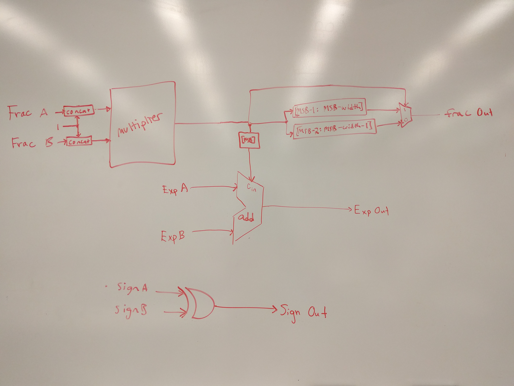
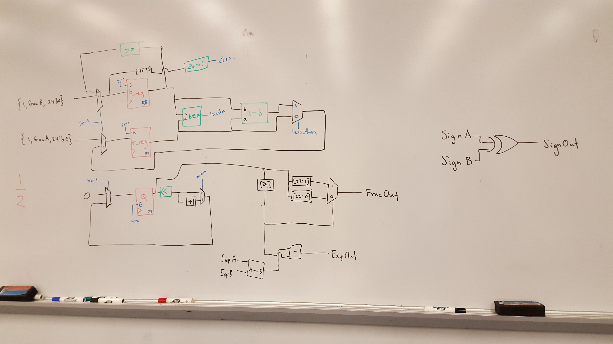
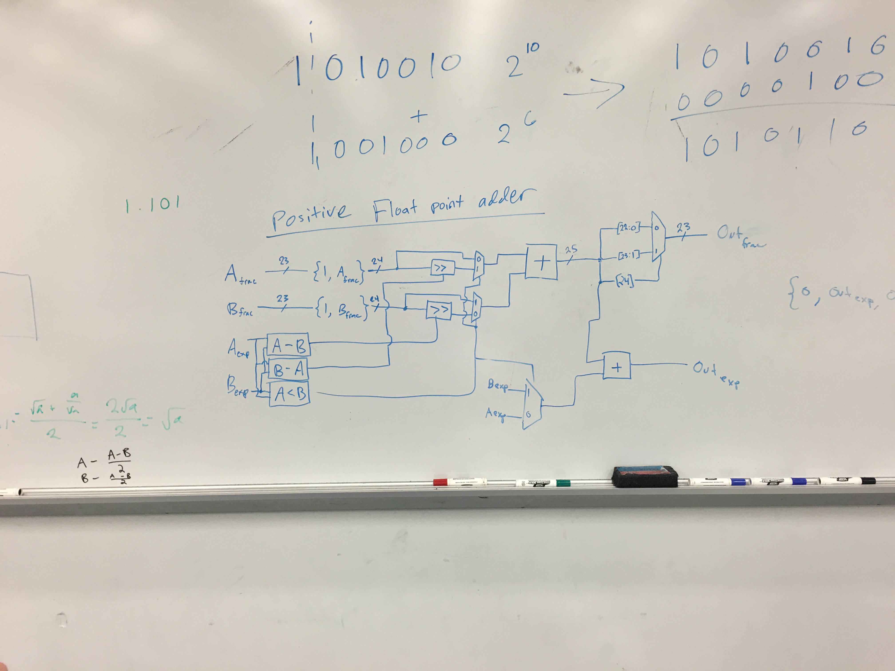
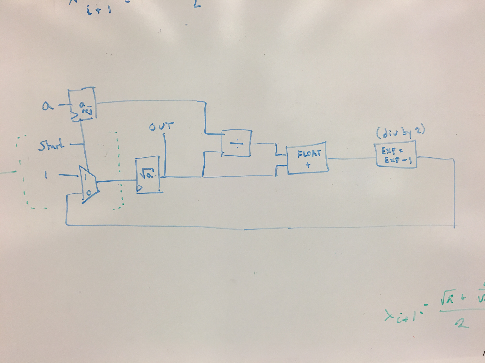

[Link to Google Doc for working on writeup](https://docs.google.com/document/d/1Hcz5kvzhGNxFzRZeGMU3i1D9Fpzi3pAoX1fYA9cflWI/edit?usp=sharing)

#Floating Point Unit // Advanced Mathematical Operations
###David Abrahams, Jenny Vaccaro, Sarah Walters, Nur Shlapobersky

##Abstract
######We built an FPU which supports addition, multiplication, division, and square-root approximation in the IEEE Standard 754 floating point format.

A floating point unit is often termed a “math coprocessor”. It has its own floating point register file and its own floating point ALU, but it shares a data memory with the CPU. There are MIPS instructions for transferring values from the CPU’s register file to the FPU’s register file and for operating on the floating point registers.


##Significance
###Floating Point Math
The IEEE 754 standard enables computers to represent non-integer numbers. IEEE 754, like an ISA, is a specification which computers of different types can conform to in order to parse a binary string representing a floating point number in the same way. The floating point format is powerful because, with 32 bits, it is able to represent decimal numbers as large as +/- 3.4*10^38 and as small as +/- 2.9*10^-39 (ignoring denormalization) with 23 bits of precision. By contrast, 32-bit signed integers range from -2.2*10^9 to 2.2*10^9.

###Mathematical Function Estimations
Floating point units (FPUs) support mathematical operations in the floating point domain. With a small number of floating point operations (addition, multiplication, division, square root), we can compute excellent approximations to a variety of functions -- trigonometric, exponentials, and logarithms, among others.

##FPU Construction

We constructed our FPU by progressively building up the complexity of our mathematical components. We began with a simple converter from 32-bit integer format to 32-bit single precision floating point format, which is required if we want our CPU to be able to pass immediates to the FPU.


###Multiplication
Our next module was an integer multiplier which performs a series of shifts and additions to calculate the product of two inputs. This was easily scalable into a floating-point multiplier, since the only additional operations needed were to keep track of exponents and appropriately place the radix point after a multiplication.



###Division
In order to perform a floating point division, we realized we needed a floating point Simple-Less-Than module and Zero checker. We used behavioural verilog to model these in order to maximize the time we spent constructing new mathematical operation modules (although it would essentially involve a converter and the bitwise modules we constructed for our earlier ALU). The divider uses combinations of shifts and subtractions to calculate the quotient.



###Square Root
Our square root approximation module required one more component: a simple positive number floating-point adder. The floating point adder right-shifts the number with the smaller exponent, and then adds the numbers together in the base of the larger number.



Finally, we had all the necessary modules for performing a square root calculation. We used Newton’s method, which offers an approximation based on the following equation
```
a_(n+1) = (a_n + S/a_n)/2
```
where `a` is our approximation of the square root and `S` is the operand.

We created a module which simulates this calculation, and performs this iteratively for the length of one cpu clock cycle, which allows for approximately 20 iterations.



###Integration
WRITE THINGS HERE ABOUT INTEGRATION


##Assembly Operations
WRITE THINGS HERE ABOUT OUR ASSEMBLY OPERATIONS


##Testing
WRITE THINGS HERE ABOUT OUR TESTS


##Difficulties
Withing each floating-point module, we encountered the constant difficulty of keeping track of our radix point. Each mathematical operation required different methods of calculating the resultant position. Most of the time we spent debugging was to diagnose incorrect placement of radix points.

Division and multiplication rely on repeated subtractions or additions, respectively. This necessitates deciding between using only combinational logic and using up large amounts of space, or using clocked logic and less space.

Clocking operations properly. We ran into some problems becaus we're single cycle, but you'd run into others if you were multi-cycling.

Properly calculating radix point locations. Using mostly combinational logic. Figure out what scenarios we're going to run into.

##Work Plan Reflection
All our planned operations were diagrammed by our 2nd meeting.
Lot of debugging to figure out division problems
Working in parallel on documentation and debugging.
Most of mathematics is far easier to understand than we expected.