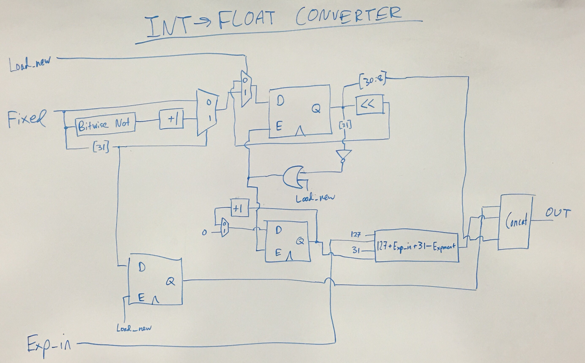
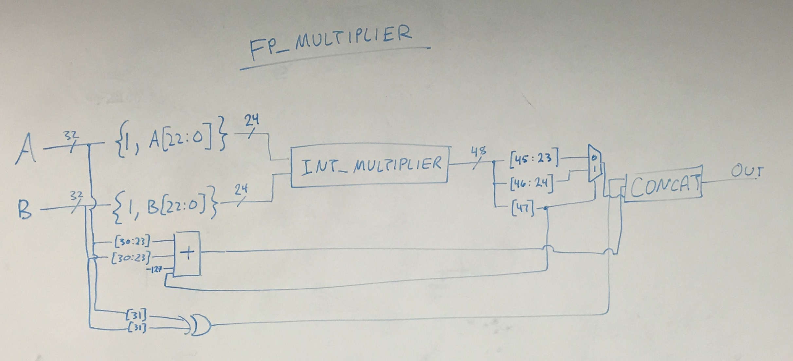
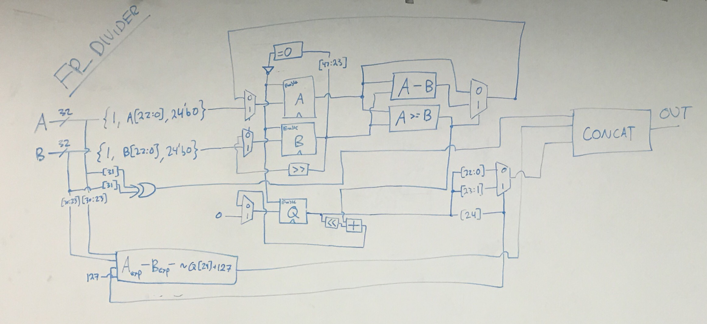
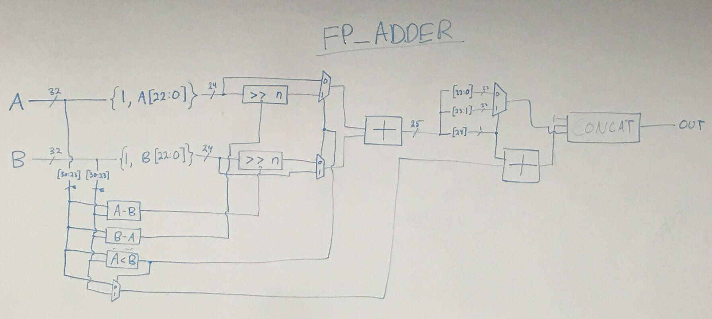
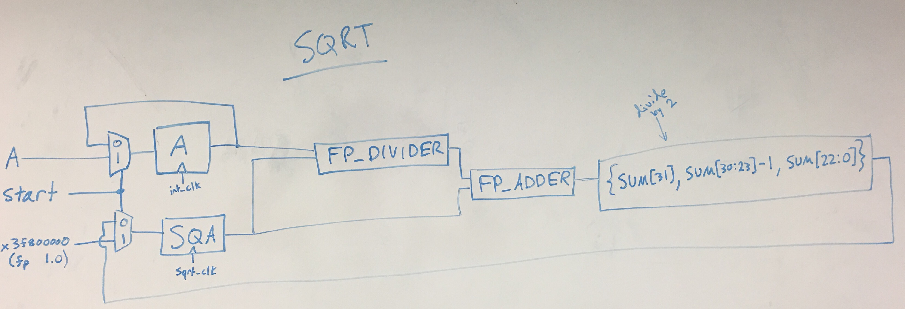
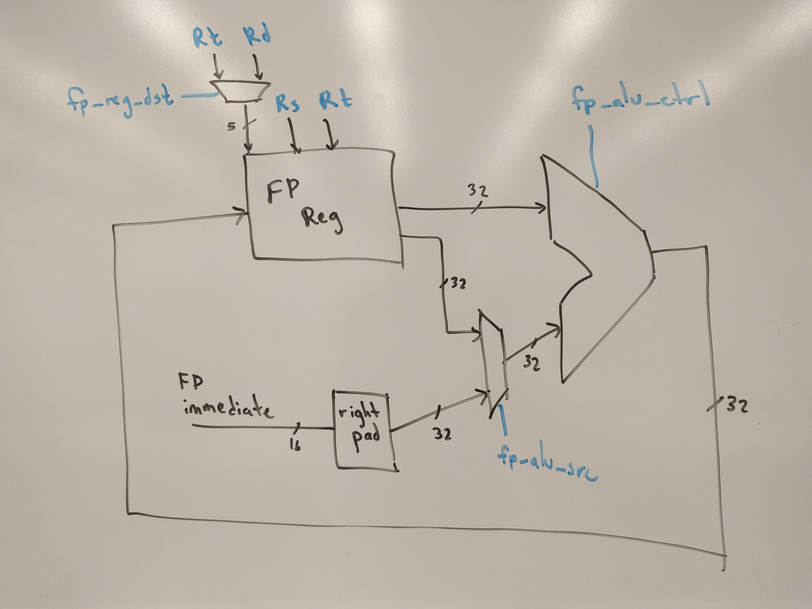
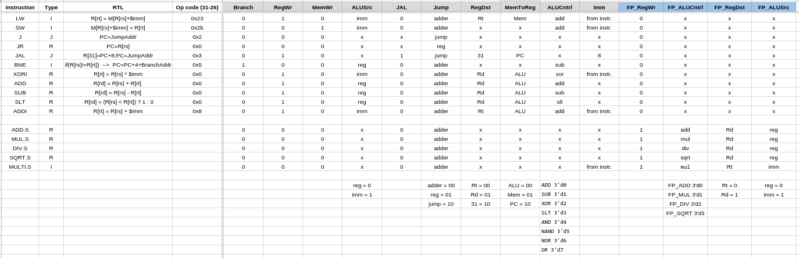

#Floating Point Unit // Advanced Mathematical Operations
###David Abrahams, Jenny Vaccaro, Sarah Walters, Nur Shlapobersky

##Abstract
######We built an FPU which supports addition, multiplication, division, and square-root approximation in the IEEE Standard 754 floating point format.

A floating point unit is often termed a “math coprocessor”. It has its own floating point register file and its own floating point ALU, but it shares a data memory with the CPU. There are MIPS instructions for transferring values from the CPU’s register file to the FPU’s register file and for operating on the floating point registers.


##Significance
###Floating Point Math
The IEEE 754 standard enables computers to represent non-integer numbers. IEEE 754, like an ISA, is a specification which computers of different types can conform to in order to parse a binary string representing a floating point number in the same way. The floating point format is powerful because, with 32 bits, it is able to represent decimal numbers as large as +/- 3.4\*10<sup>38</sup> and as small as +/- 2.9\*10<sup>-39</sup> (ignoring denormalization) with 23 bits of precision. By contrast, 32-bit signed integers range from -2.2\*10<sup>9</sup> to 2.2*10<sup>9</sup>.

###Mathematical Function Estimations
Floating point units (FPUs) support mathematical operations in the floating point domain. With a small number of floating point operations (addition, multiplication, division, square root), we can compute excellent approximations of a variety of functions -- trigonometric, exponentials, and logarithms, among others.

##FPU Construction

We constructed our FPU by progressively building up the complexity of our mathematical components. We began with a simple converter from 32-bit integer format to 32-bit single precision floating point format.



The converter functions by first converting 2s complement negatives to their corresponding positive number. It left shifts the 32-bit fixed number until it encounters a 1 in the MSB. It then outputs the result as a floating point number, which consists of a sign bit, the correct 2<sup>n</sup> exponent, and 23 significant digits after the radix point.

###Multiplication

Our next module was an integer multiplier which performs a series of shifts and additions, simulating grade-school multiplication, to calculate the product of two inputs. This was easily scalable into a floating-point multiplier, since the only additional operations needed were to keep track of exponents and appropriately place the radix point after a multiplication. The multiplier works similiar to how one does multiplication by hand, left shifting one of the operands and then adding it to the result if the corresponding bit of the other operand is 1.



###Division
In order to perform a floating point division, we follow a similar procedure as mulitplication, emulating the long division process. The divider uses combinations of shifts, less-than checks, and subtractions to calculate the quotient.



###Square Root
Our square root approximation module required one more component: a simple positive number floating-point adder. The floating point adder right-shifts the number with the smaller exponent, and then adds the numbers together in the base of the larger number.



Finally, we had all the necessary modules for performing a square root calculation. We used Newton’s method, which offers an approximation based on the following equation

a<sub>n+1</sub> = (a<sub>n</sub> + S/a<sub>n</sub>)/2

where a<sub>n</sub> is the n<sup>th</sup> approximation of the square root and S is the operand. a<sub>1</sub> is always 1.

We created a module which simulates this calculation, and performs this iteratively for the length of one CPU clock cycle, which allows for approximately 20 iterations.



###Integration
In order to test our floating point math by running assembly code, we integrated the floating point unit with a single-cycle CPU from Lab 3. The integration was limited: we do not allow floating point values to be stored to memory. Instead, floating point number values are limited to a floating point register. This allowed us to run the MIPS operations of `add.s`, `mul.s`, `div.s`, and `sqrt.s`. Unlike `add.s`, our addition operation only adds the magnitudes of its operands -- in other words, it only adds positive numbers. Additionally, though MIPS does not support this function, we supported a multiply by immediate operation, which we refer to as `multi.s`. We repurposed the zero register of the regfile to store the IEEE 754 representation of the number 1; this allowed us to multiply IEEE 754-format floats into floating point registers.

The floating point unit is almost entirely detached from the CPU -- the only link between them is the instruction decode module in the CPU, which provides command flags both to the main CPU and to the FPU coprocessor. Instruction fetch is handled by the CPU just as in Lab 3.




##Assembly Operations
MIPS includes op codes for `mul.s`, `div.s`, `add.s`, and `sqrt.s`. However, because no floating point MIPS instructions are I-type (MIPS FPUs do not deal with immediates), our multiply by immediate operation is an invented I-type instruction with an op code of h12. Inventing an instruction added complexity: we had to write hexadecimal instructions by hand instead of writing Assembly programs in MARS and compiling them.


##Testing
We created test programs for each of the four operations. Below are the pseudo-Assembly instructions and links to the hexadecimal instruction files for the four programs.

* Floating point addition ([hexadecimal instructions](data/fp_add.dat))
```
multi.s $t0, $zero, (4 in floating point)
multi.s $t1, $zero, (6 in floating point)
add.s $t2, $t0, $t1
```
* Floating point division ([hexadecimal instructions](data/fp_divide.dat))
```
multi.s $t0, $zero, (4 in floating point)
multi.s $t1, $zero, (6 in floating point)
div.s $t2, $t0, $t1
```
* Floating point multiplication ([hexadecimal instructions](data/fp_multiply.dat))
```
multi.s $t0, $zero, (4 in floating point)
multi.s $t1, $zero, (6 in floating point)
mul.s $t2, $t0, $t1
```
* Square root approximation ([hexadecimal instructions](data/fp_sqrt.dat))
```
multi.s $t1, $zero, (6 in floating point)
sqrt.s $t2, $t1
```

##Difficulties

We found it consistently difficult to keep track of the radix point when writing our floating point modules. Each mathematical operation required different methods of calculating the resultant radix point position. Most our time spent debugging had to do with incorrect placement of radix points.

Additionally, adding on the implicit 1 at the beginning of floating point numbers to do operations and then removing it afterward caused many off-by-one errors. Often the new implicit one would not be in the same spot as the operand's implicit one.

Division and multiplication rely on repeated subtractions or additions, respectively. This necessitates deciding between using only combinational logic and using up large amounts of space, or using clocked logic and less space. Because we decided to use clocked logic, we had to create multiple clocks to control differential levels of abstraction. Our CPU's clock cycle ended up being 40,000 times slower than the fastest clock.

##Work Plan Reflection

We were reasonably accurate with scoping the project in terms of time spent, but we allotted time incorrectly. We were able to accomplish everything we had planned, and succeeded at a stretch goal of integrating the FPU coprocessor with a single-cycle CPU from Lab 3.

We allotted the most time to algorithm development, but it was reasonably simple to determine an algorithm for each mathematical operation. We spent most of our time creating block diagrams to execute the algorithms, debugging the corresponding verilog modules, and debugging the CPU integration.

##Future Work
* Write programs to approximate trigonometric functions or logarithms using Taylor series
* Link the FPU to the CPU's data memory
* Support the real MIPS commands for loading floating point numbers into the FPU (either via data memory or from the CPU's register file)
